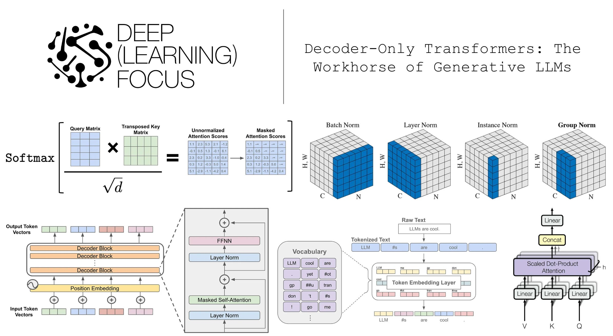

# pytorch-leetcode
A collection of PyTorch algorithms implemented from scratch — activations, layers, losses, and more.

## Notebooks

| Topic | File |
|-------|------|
| ReLU | [notebook/relu.ipynb](notebook/relu.ipynb) |
| Softmax | [notebook/softmax.ipynb](notebook/softmax.ipynb) |
| Linear Layer | [notebook/linear.ipynb](notebook/linear.ipynb) |
| Layer Normalization | [notebook/layer_norm.ipynb](notebook/layer_norm.ipynb) |
| Scaled Dot-Product Attention | [notebook/attention.ipynb](notebook/attention.ipynb) |
| Multi-Head Attention | [notebook/mha.ipynb](notebook/mha.ipynb) |
| Grouped Query Attention | [notebook/gqa.ipynb](notebook/gqa.ipynb) |

## References

- [Decoder-Only Transformers: The Workhorse of Generative LLMs](https://cameronrwolfe.substack.com/p/decoder-only-transformers-the-workhorse)
- [TorchCode](https://github.com/duoan/TorchCode)

